# framedeck - layer guide

The acrylic case is built in layers.  I've included DXF files suitable
for laser printing, they use MM as units.  Layers are built in roughly
alphabetical order from the top down, but some layers appear twice and 
may be different thicknesses.

Please see this table below for full details

## Hardware
Layer|Thickness (MM)|Notes|Image
---|---|---|---
A|1.5|Top|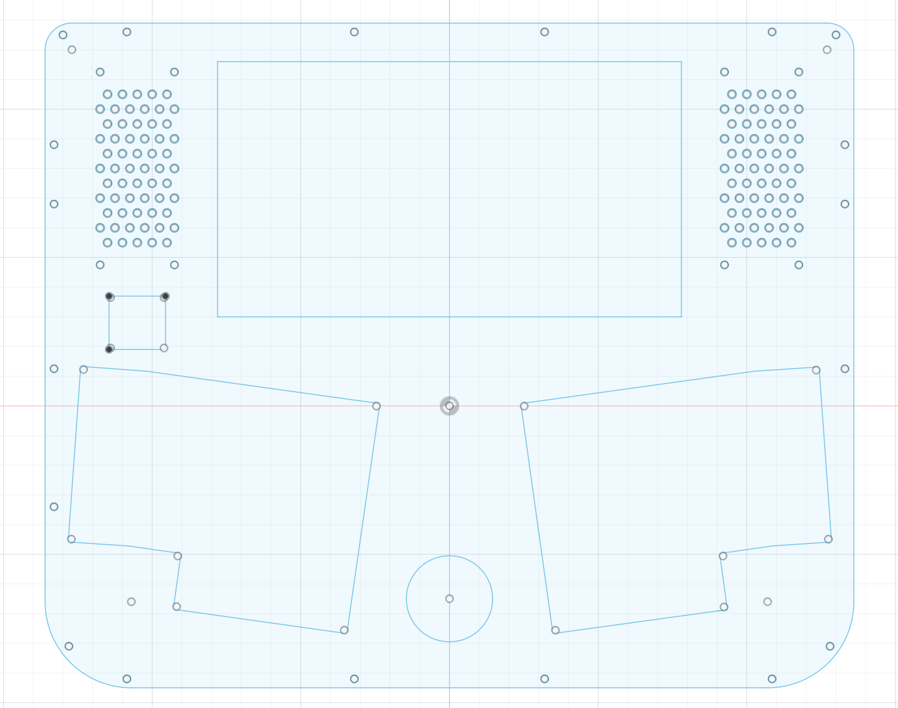
B|2.0||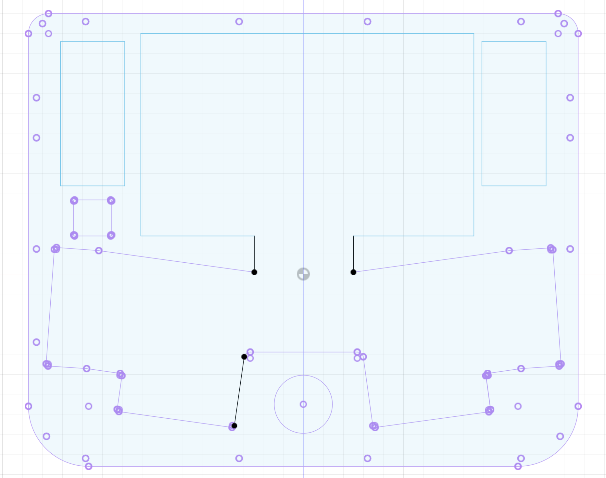
C (1)|1.5||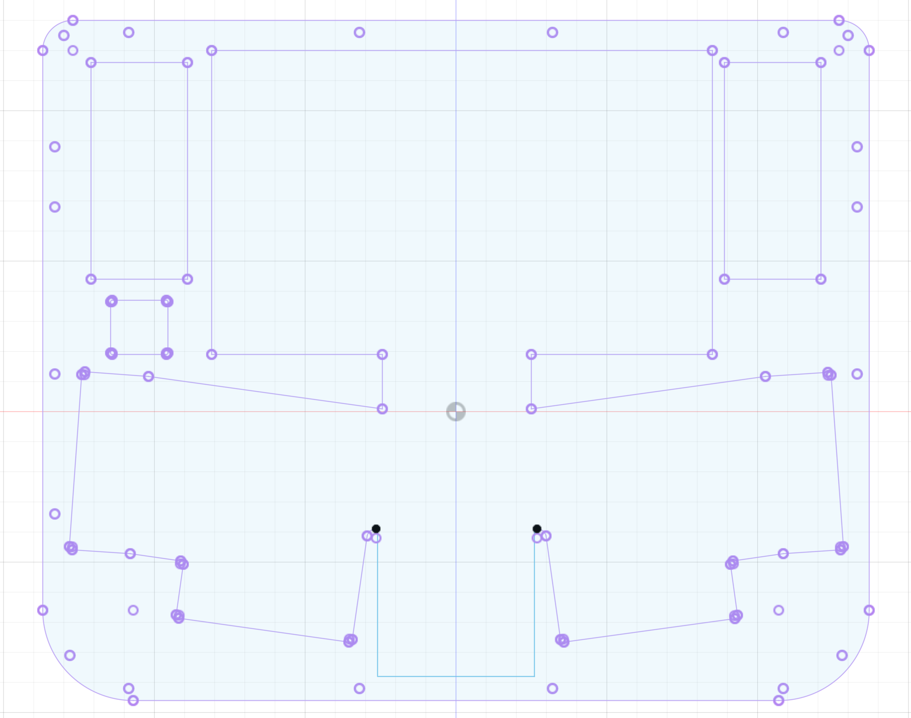
C (2)|1.5||
D|1.5|KB Plate|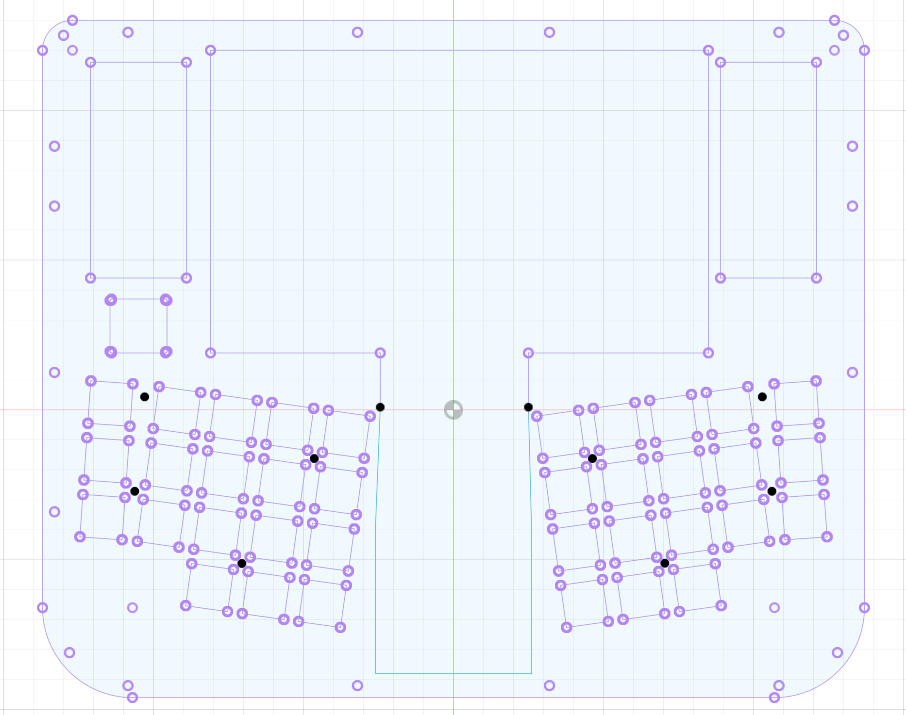
E (1)|1.5| E/G Layers use same file|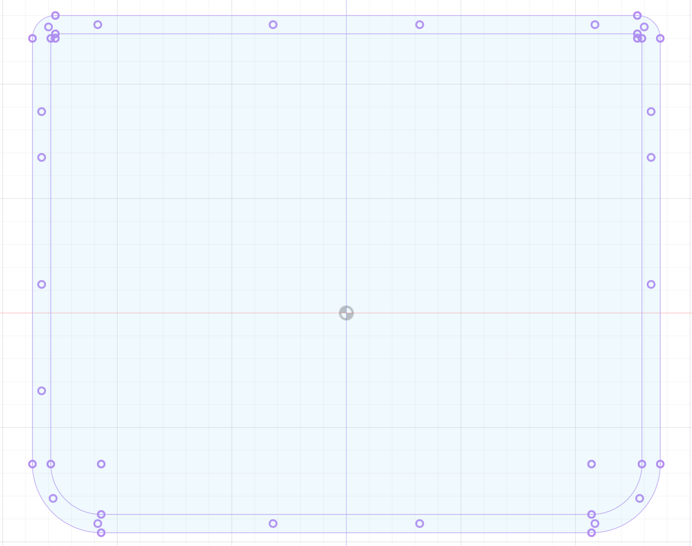
F|1.5|Power switch|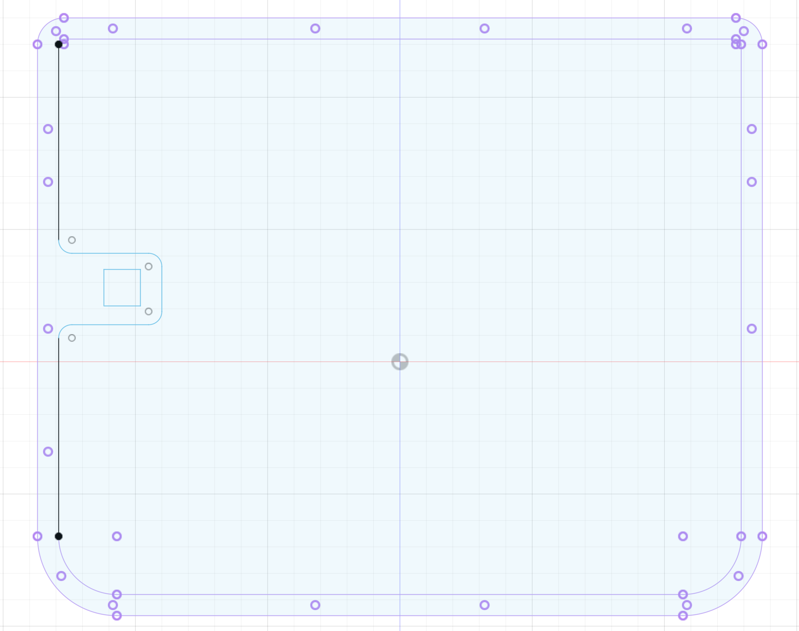
G|3.0| E/G Layers use same file|
H|3.0||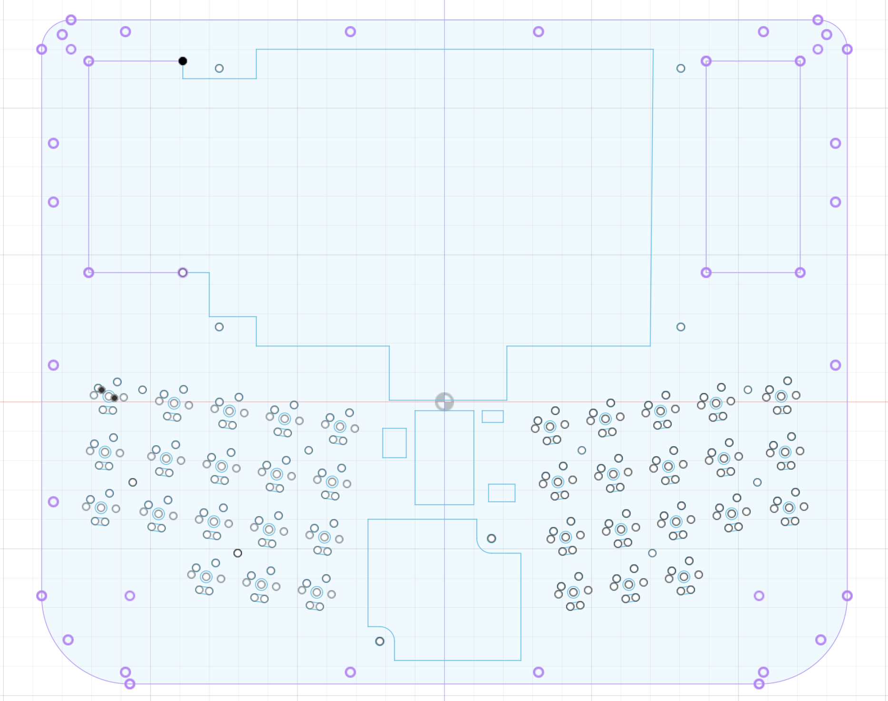
E (2)|1.5|E/G Layers use same file|
I|3.0||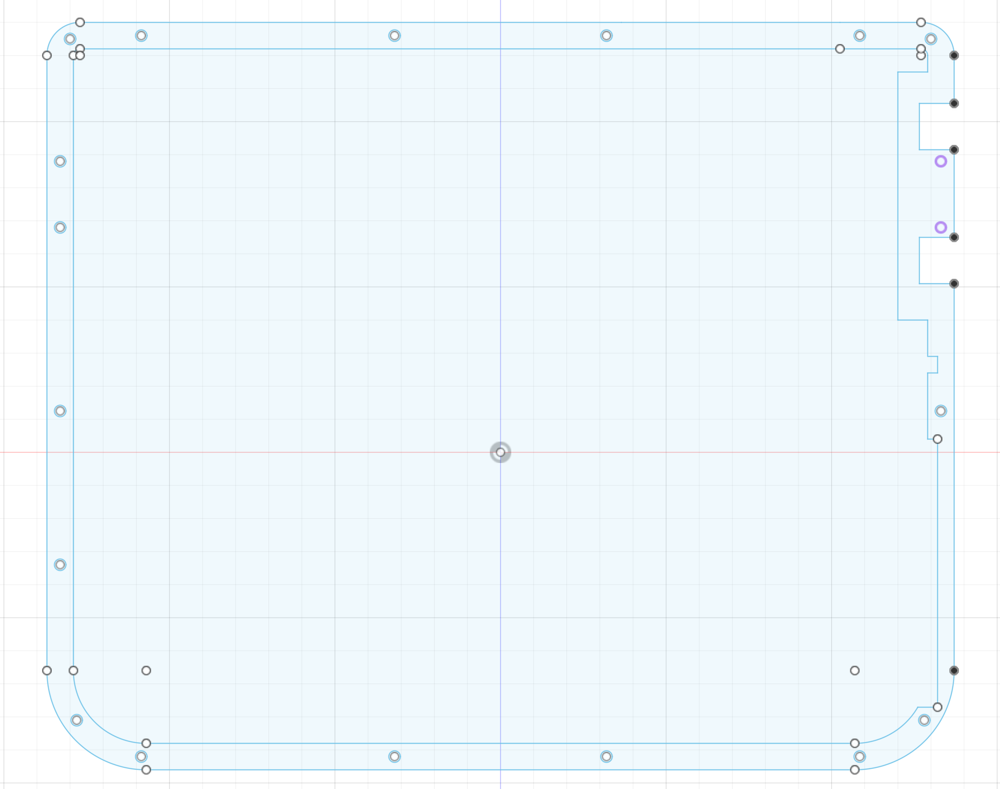
J (1)|2.0||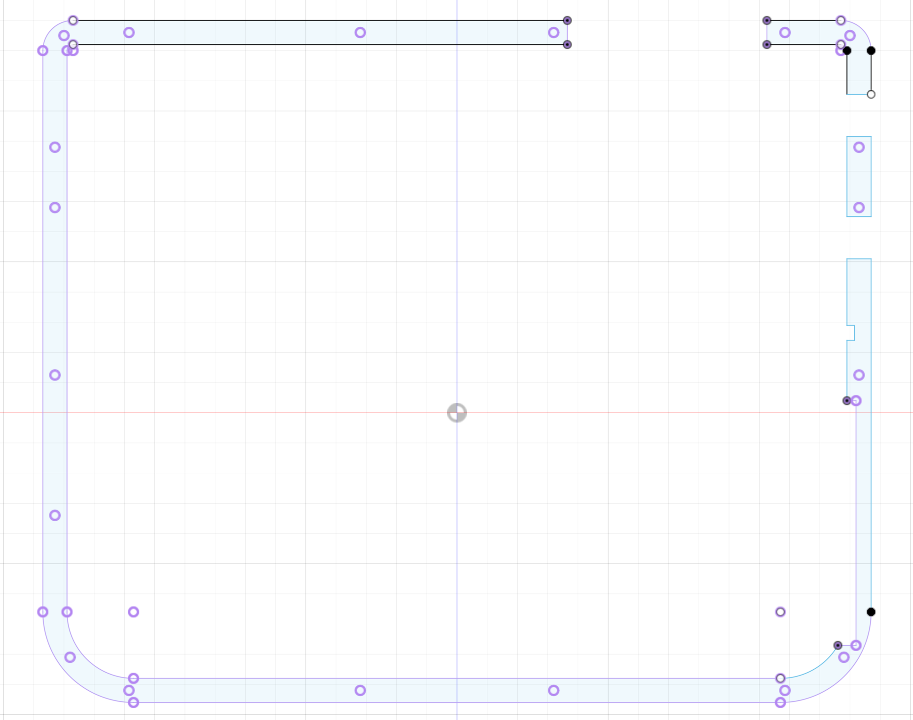
J (2)|2.0||
K|3.0||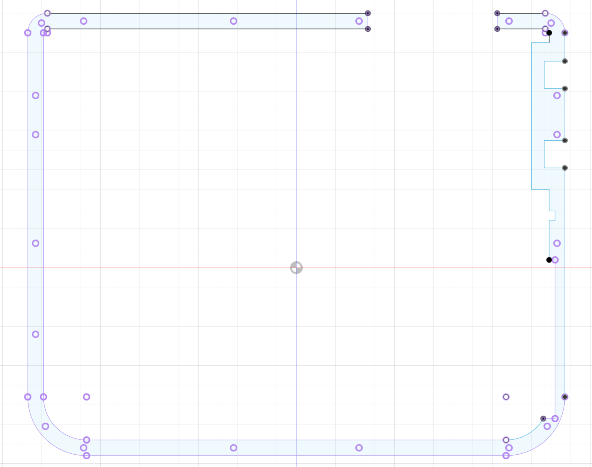
L|1.5|Bottom|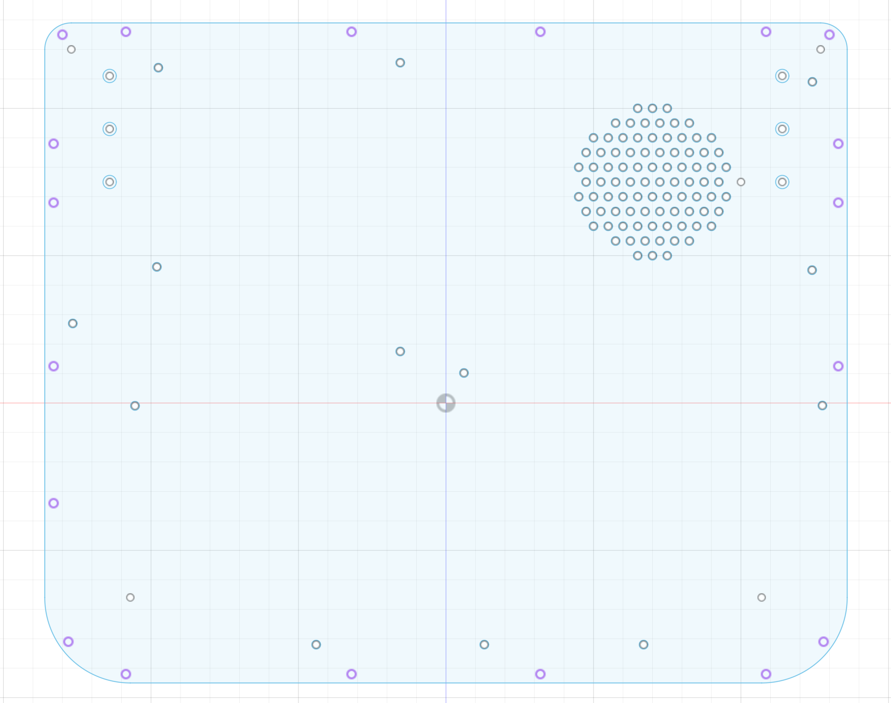
M|1.5|Bottom|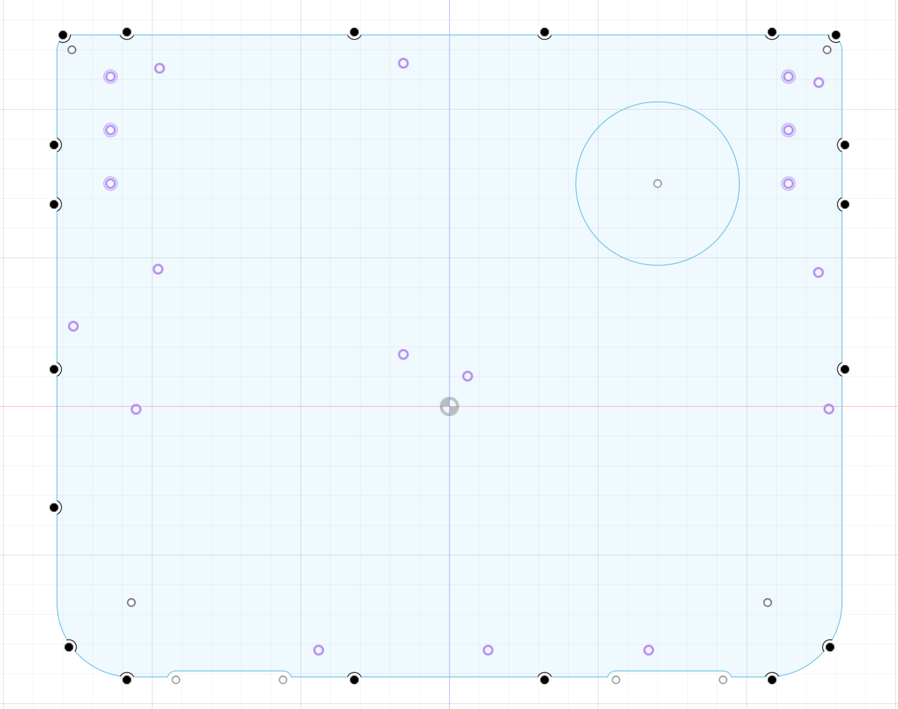
