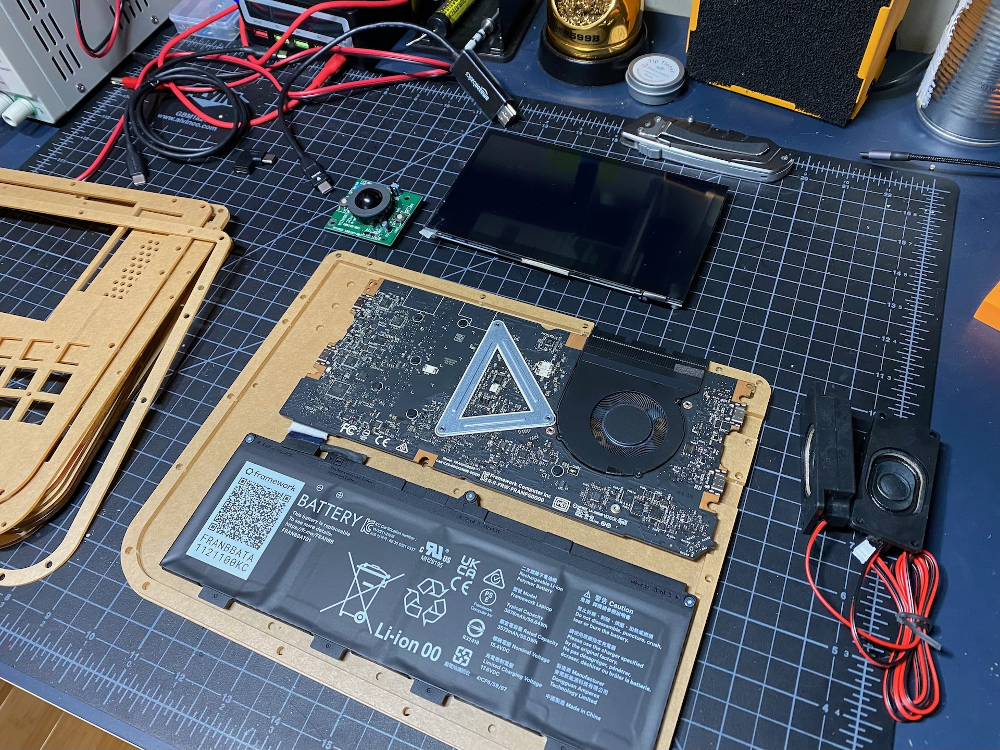
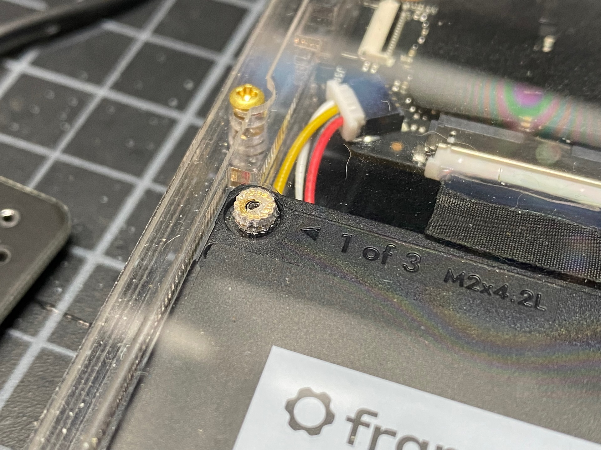
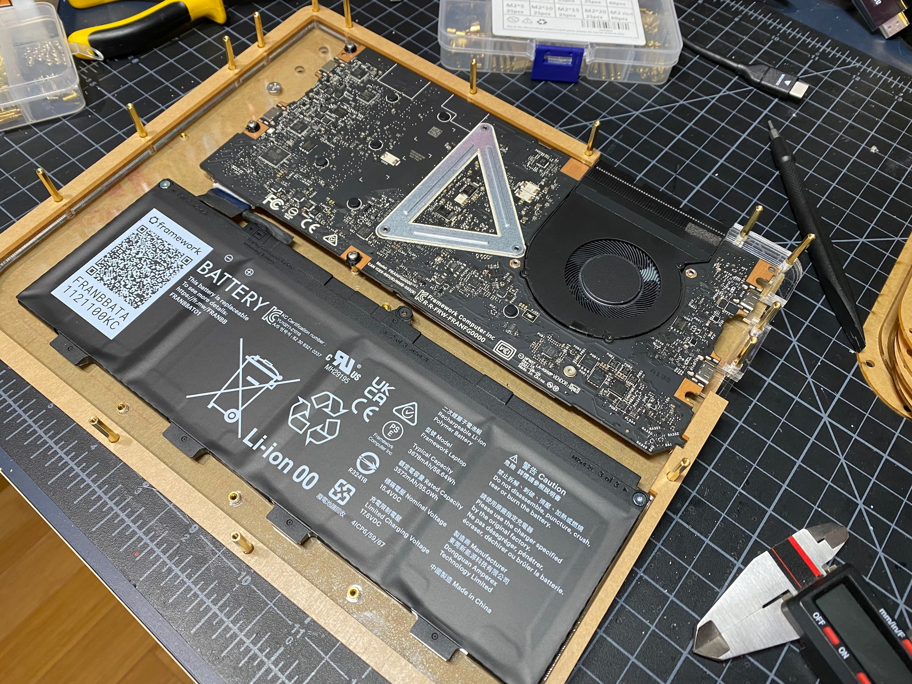
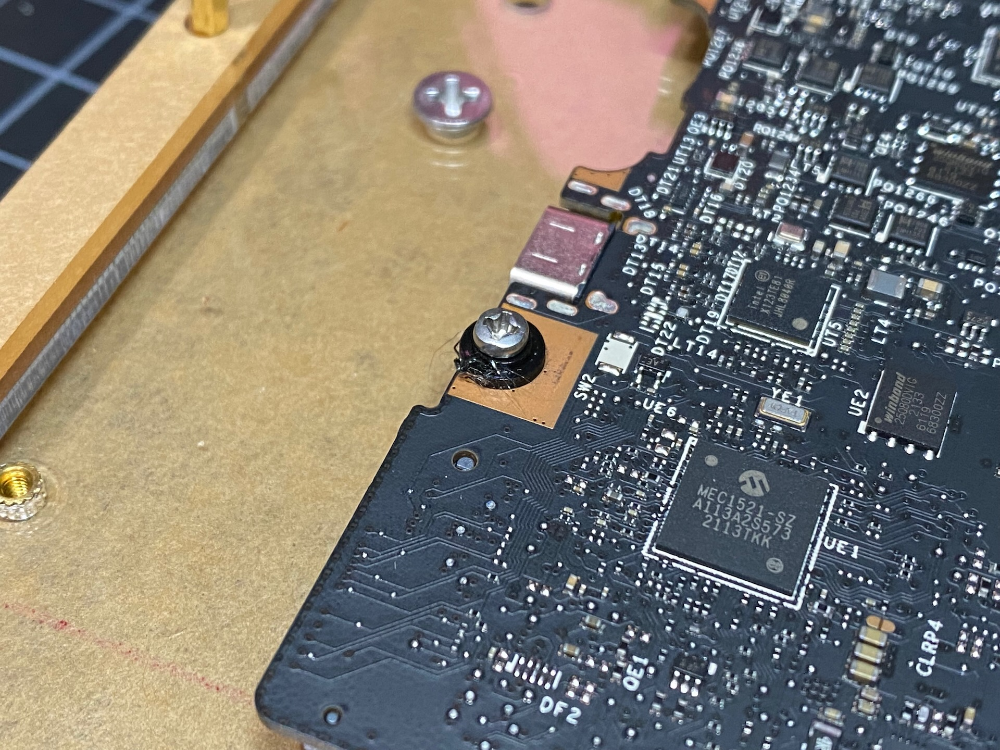
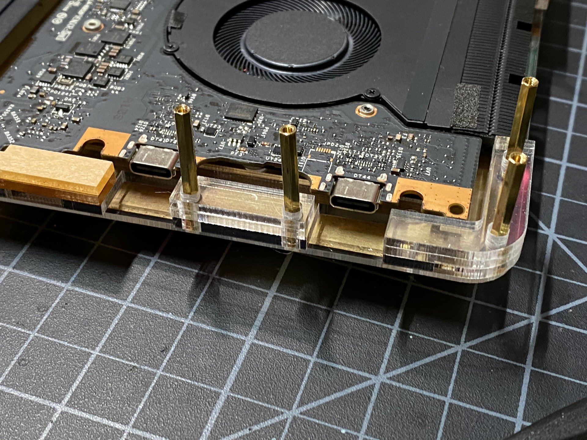
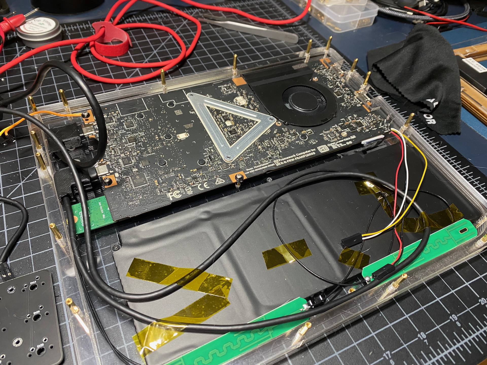
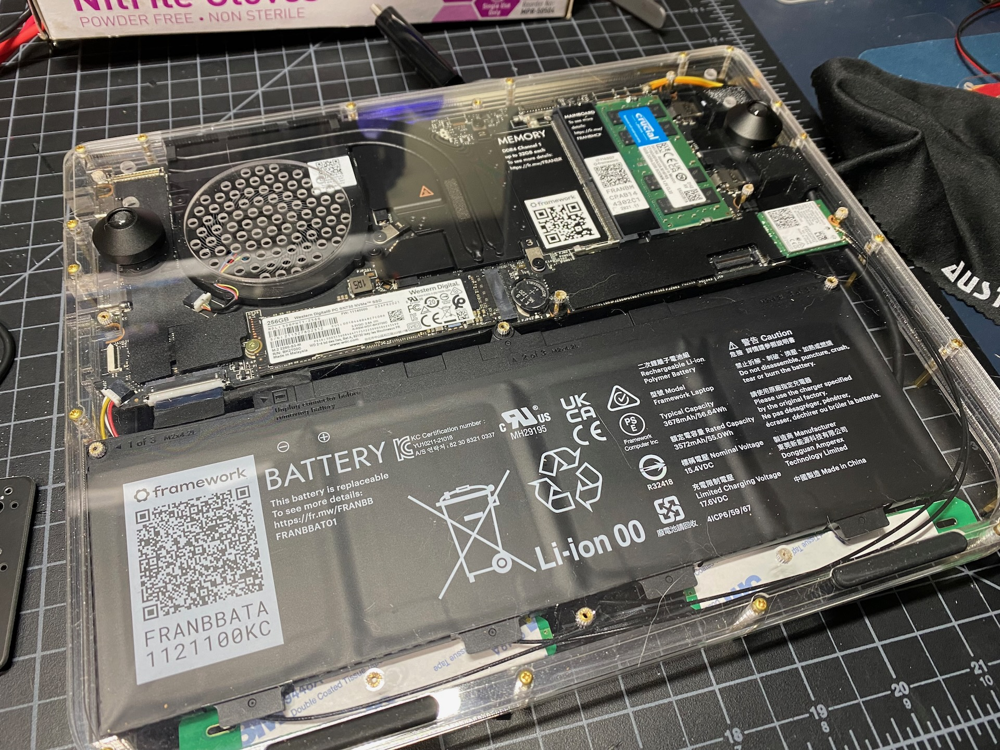

# framedeck - Build Tour

This is not intended to be a full guide, more an inspirational look 
at the build process.  You can review the [Parts list](../docs/parts.md)
to get oriented.  I took all of these photos with my phone as I was building 
so the quality and lighting vary a fair bit.  If you are hoping to build 
something similar and have questions, please reach out and I'd be happy to
answer them!

## Overview

This image shows most of the main components.  The only big thing missing here
is the custom keyboard PCB.  The case is built up from [layers](../case/layers.md) of laser cut acrylic 
of various shapes.  As the stack is built from bottom to top, various components 
are affixed to the acrylic pieces as they are layered on. 

There are four main groupings of layers where particular items attach.

## Mainboard and Battery
The two bottom layers are held together with heat-set inserts.  The layers are 1.5mm each and 
the inserts are 3mm, so they can extend through both layers and secure them together.  This 
also provides the mounting points for the battery and mainboard.  

Here you can see the placement of the mainboard and battery... but I installed the battery
in the wrong orientation!  I decided to install the mainboard and batter 'upside down' so
they would be fully visible from the bottom of the unit.  The mainboard is correctly oriented
but the batter connector is on the wrong side and the middle mountpoint doesn't line up.  This
photo does show the small notch in some of the lower layers to accomidate the battery.  It has
to sit just so in relation to the mainboard as the connector is shot and rather stiff.

I stuck with M2 hardware generally, but had to print up little adapters to fit the larger
mainboard mounting points.  

This bottom 'unit' consists of layers M-I and sandwiches the available USB ports between layers
of acrylic.  It's difficult to see from this photo, but there is acrylic under the USB ports and 
a matching layers sits on top.  Here you can also see the long stand-offs required to sandwich
all the layers together.

This portion of the unit also has the wifi card (plugged into the mainboard), wifi antenna
speaker wires plugged into the mainboads, and some custom made right-angle usb-c connectors 
which are fully enclosed and run the screen and keyboard.  The top is a USB-C to hdmi cable 
and the bottom is a USB-C to USB-C to
plug into the keyboard microcontroller.  Below you can see some of the cable management and 
all the pieces ready to be covered with subsequent layers

Finally, here's a shot of the bottom of the unit with the mainboard and battery presented.  This
also shows the ventilation holes in the case for the mainboard fan.  It vents out the back of the
unit through a nice heatsink assembly which all comes with the mainboard.  Also visible are the 
repositionable conical feet for the back and the low-profile SKUF feet in the front.  This 
provides a bit of a typing angle and makes the screen a little easier to see.

## Screen and Trackball

## Keyboard and Trackball (again)

## Top and speakers

